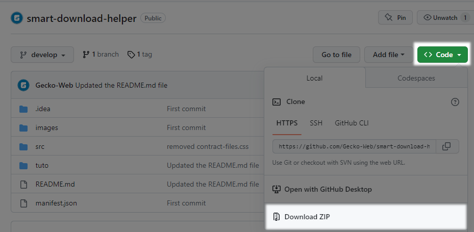
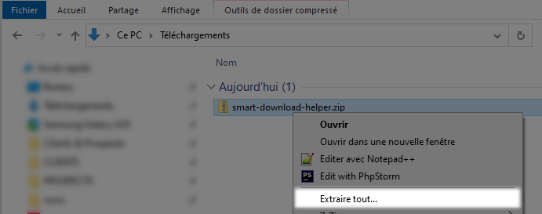
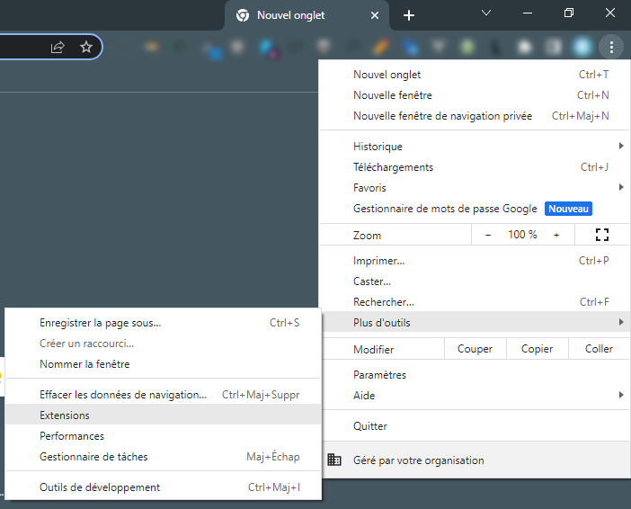
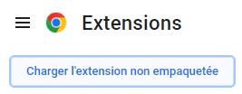
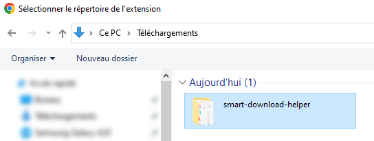
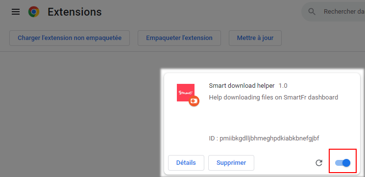

> **Smart Download Helper**  
> *Help downloading files on SmartFr dashboard*  
> 
> __website :__ www.gecko-web.fr                                   
> __contact :__ contact@gecko-web.fr

***

>
> Ce plugin à pour but de simplifier le téléchargement des fichiers liés aux contrats de travail sur l'interface SmartFr.
> 

# Installer le plugin

1. Téléchargez l'archive de la dernière version du plugin 
   > Rendez-vous sur le dépôt git https://github.com/Gecko-Web/smart-download-helper

   

2. Extraire l'archive
   > ATTENTION :  
   > Une fois l'extension installée, si son répertoire est supprimé, l'extension ne fonctionnera plus.
   > 
   > Assurez-vous d'extraire les fichiers dans un dossier que vous ne supprimerez pas involontairement.
   > Par exemple : *C:\Program Files\smart-download-helper*
   > 

   
  

3. Ouvrez le navigateur chrome (https://www.google.com/intl/fr_fr/chrome/)

4. Rendez-vous dans le menu en haut à droite du navigateur  
   

5. Rendez-vous dans le menu de gestion des extensions de Chrome 
   > Menu `Plus d'outils > Extensions`
  
   

6. Activez le `mode développeur`  
   

7. Cliquez sur le bouton `Charger l'extension non empaquetée`  
   
   

8. Sélectionnez le répertoire extrait à l'étape n°2 
   > Par exemple : *C:\Program Files\smart-download-helper*  
   
   
  

9. L'extension devrait être chargée
   > Pensez à bien activer l'extension

   
  
10. Connectez-vous à cotre compte SmartFr
   > https://compte.smartfr.fr

11. Rendez-vous sur la liste des contrats acceptés
    > Menu `Historique > Contrats acceptés`
   
12. Si le plugin est bien chargé et activé, une fenêtre de gestion des téléchargements apparaît sur la page
    

13. Enjoy ! 