

  

Because downloading all this is pain in the ass...

> **Smart Download Helper**  
> *Chrome & Firefox extension to help download files from the SmartFr dashboard*
>
> __website :__ www.gecko-web.fr                                   
> __contact :__ contact@gecko-web.fr

***

>
> Cette extension à pour but de simplifier le téléchargement des fichiers liés aux contrats de travail sur l'interface
> SmartFr.
>

# Télécharger l'extension

**1°** Téléchargez l'archive de la dernière version de l'extension
> Rendez-vous sur le dépôt git https://github.com/Gecko-Web/smart-download-helper

**2°** Extraire l'archive
> ATTENTION :  
> Une fois l'extension installée, si son répertoire est supprimé, l'extension ne fonctionnera plus.
>
> Assurez-vous d'extraire les fichiers dans un dossier que vous ne supprimez pas accidentellement.  
> Par exemple : `C:\Program Files\smart-download-helper`
>

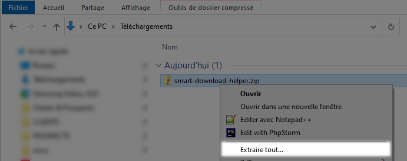

# Installer l'extension

Cette extension est compatible avec les navigateurs **Chrome** et **Firefox** mais n'étant pas publiée dans les magasins
des
navigateurs, son installation est un peu particulière et doit se faire "à la main".

## Chrome

**1°** Ouvrez le navigateur chrome (https://www.google.com/intl/fr_fr/chrome/)

**2°** Rendez-vous dans le menu en haut à droite du navigateur  

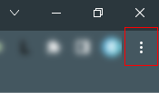

**3°** Rendez-vous dans le menu de gestion des extensions de Chrome
> Menu `Plus d'outils > Extensions`

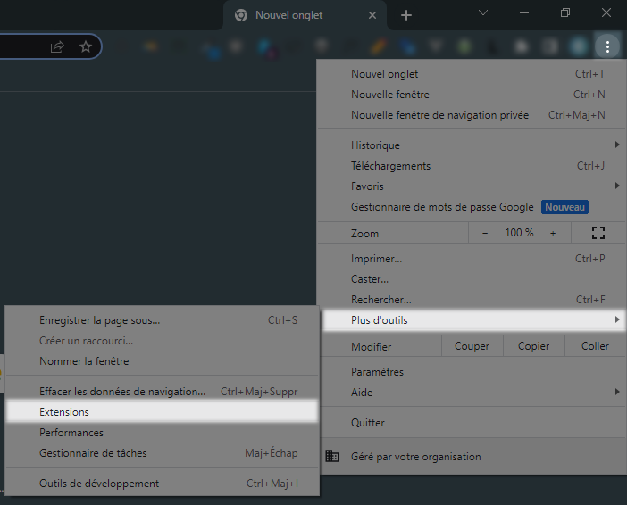

**4°** Activez le `mode développeur`  

**5°** Cliquez sur le bouton `Charger l'extension non empaquetée`

**6°** Sélectionnez le répertoire extrait à l'étape n°2
> Par exemple : `C:\Program Files\smart-download-helper`

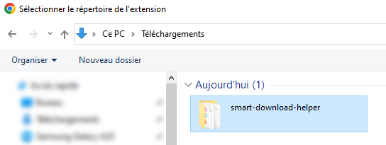

**7°** L'extension devrait être chargée
> Pensez à bien activer l'extension

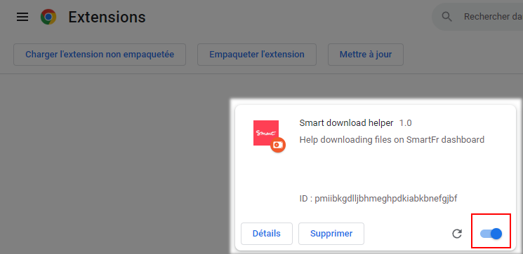

**8°** Connectez-vous à votre compte SmartFr
> https://compte.smartfr.fr

**9°** Rendez-vous sur la liste des contrats acceptés
> Menu `Historique > Contrats acceptés`

**10°** Si l'extension est bien chargée et activée, une fenêtre de gestion des téléchargements apparaît sur la page

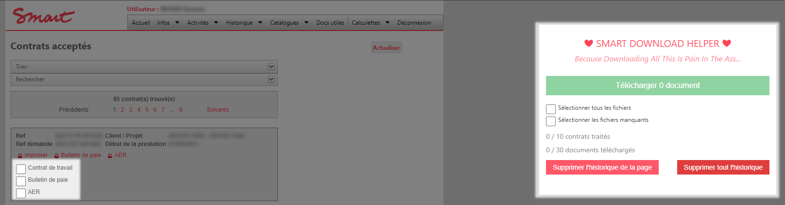

**11°** Enjoy ! 

## Firefox

**1°** Ouvrez le navigateur firefox (https://www.mozilla.org/fr/firefox/new/)

**2°** Rendez-vous dans le menu en haut à droite du navigateur  

**3°** Rendez-vous dans le menu de gestion des extensions de Firefox
> Menu `Extensions et thèmes`

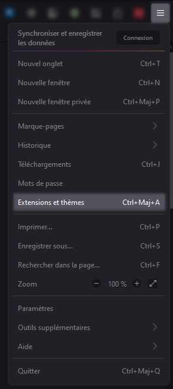

**4°** Cliquez sur le menu `Déboguer les modules`  
> Un nouvel onglet va s'ouvrir.

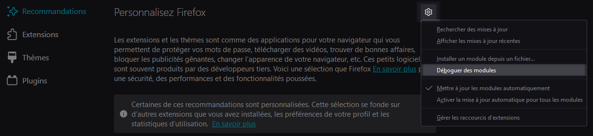

**5°** Cliquez sur le bouton `Charger un module complémentaire temporairement`

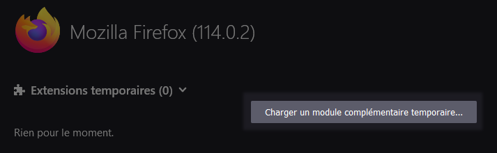

**6°** Sélectionnez le fichier `manifest.json` dans le répertoire extrait à l'étape n°2
> Par exemple : `C:\Program Files\smart-download-helper\manifest.json`

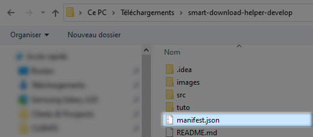

**7°** L'extension devrait être chargée

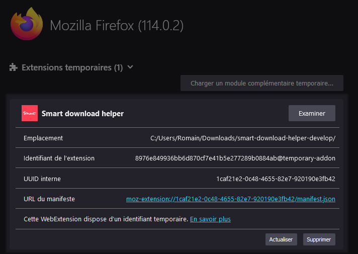

**8°** Autorisez le chargement automatique de l'extension sur la page
> Retournez dans le menu de gestion de vos extensions  
> Menu `Extensions et thèmes`

> Rendez-vous dans le menu de gestion de l'extension `Smart download helper`

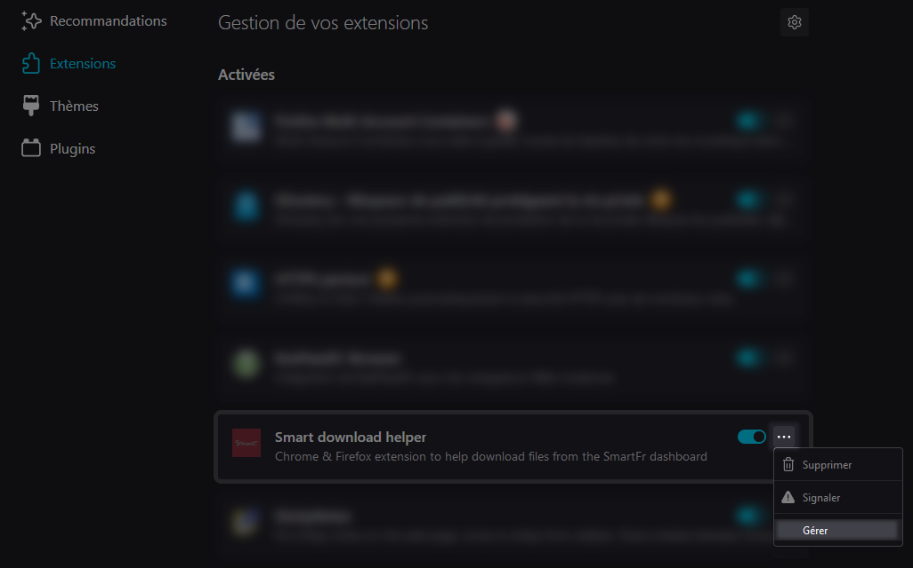

> Onglet `Permissions`  
> Cliquez sur `Accéder à vos données pour https://compte.smartfr.fr`

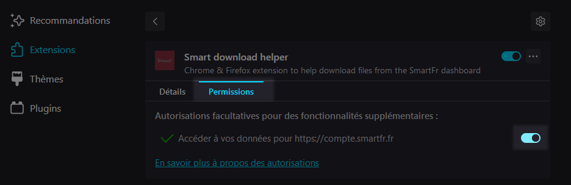

**9°** Connectez-vous à votre compte SmartFr
> https://compte.smartfr.fr

**10°** Rendez-vous sur la liste des contrats acceptés
> Menu `Historique > Contrats acceptés`

**11°** Si l'extension est bien chargée et activée, une fenêtre de gestion des téléchargements apparaît sur la page

**12°** Enjoy ! 