

Because downloading all this is pain in the ass...

> **Smart Download Helper**
> *Chrome & Firefox extension to help download files from the SmartFr dashboard*
>
> __website :__ [www.gecko-web.fr](https://gecko-web.fr)
> __contact :__ contact@gecko-web.fr

---

Cette extension a pour but de simplifier le téléchargement des fichiers liés à votre activité salariée sur l'interface
SmartFr :

* Contrats de travail
* Bulletins de paie
* Attestation Employeur Dématérialisée (AER)

*Il est essentiel de télécharger et conserver ces documents qui servent de preuve de votre relation de travail,
attestent de votre rémunération, et sont indispensables pour faire valoir vos droits sociaux comme le chômage ou la
retraite.*

---

- [I. Télécharger l'extension](#i-télécharger-lextension)
- [II. Installer l'extension](#ii-installer-lextension)
  - [Chrome](#ii-chrome)
  - [Firefox](#ii-firefox)
- [III. UTILISATION DU PLUGIN](#iii-utilisation-du-plugin)
  - [Erreurs de téléchargement](#erreurs-de-téléchargement)
- [IV. Ça vous a été utile ? Faites-le-moi savoir ! 😊](#bring-me-a-beer)

---

# *I.* Télécharger l'extension

**1°** Téléchargez l'archive de la dernière version de l'extension

> Rendez-vous sur le dépôt git https://github.com/Gecko-Web/smart-download-helper

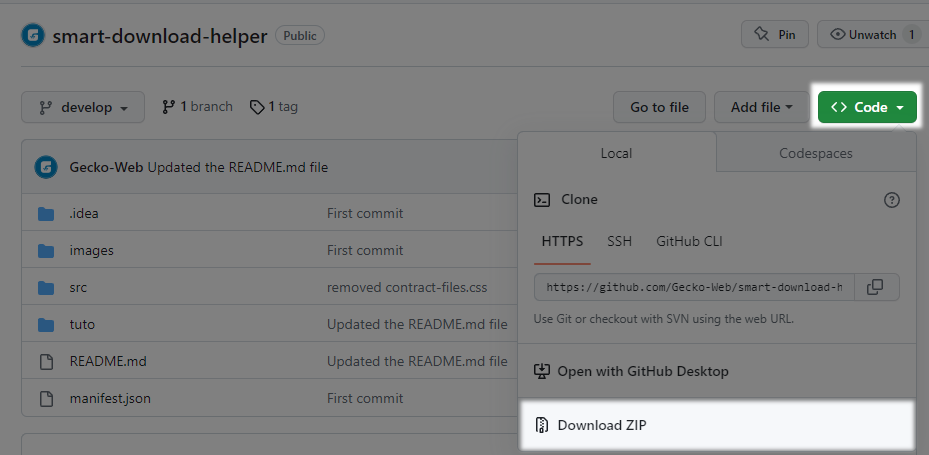

**2°** Extraire l'archive

> ATTENTION :
> Une fois l'extension installée, si son répertoire est supprimé, l'extension ne fonctionnera plus.
>
> Assurez-vous d'extraire les fichiers dans un dossier que vous ne supprimez pas accidentellement.
> Par exemple : `C:\Program Files\smart-download-helper`

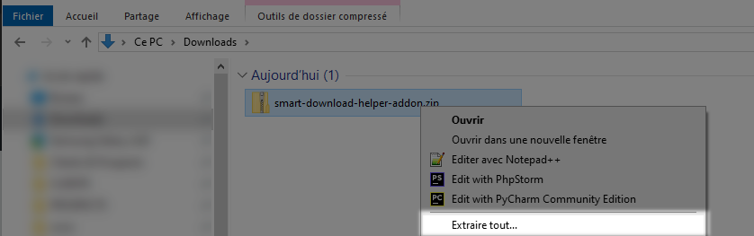

# *II.* Installer l'extension

Cette extension est compatible avec les navigateurs **Chrome** et **Firefox** mais n'étant pas publiée dans les magasins
des navigateurs, son installation est un peu particulière et doit se faire "à la main".

## Chrome

**1°** Ouvrez le navigateur chrome (https://www.google.com/intl/fr_fr/chrome/)

**2°** Rendez-vous dans le menu en haut à droite du navigateur

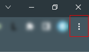

**3°** Rendez-vous dans le menu de gestion des extensions de Chrome

> Menu `Plus d'outils > Extensions`

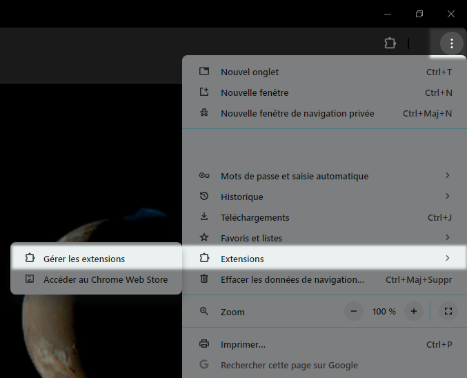

**4°** Activez le `mode développeur`

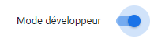

**5°** Cliquez sur le bouton `Charger l'extension non empaquetée`

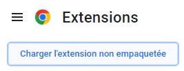

**6°** Sélectionnez le répertoire extrait à l'étape n°2

> Par exemple : `C:\Program Files\smart-download-helper`

**7°** L'extension devrait être chargée

> Pensez à bien activer l'extension

**8°** Activez le téléchargement automatique des fichiers

> Menu `Paramètres > Téléchargements`

- Sélectionnez un emplacement pour enregistrer les fichiers
- Décochez la case "Toujours demander où enregistrer les fichiers"

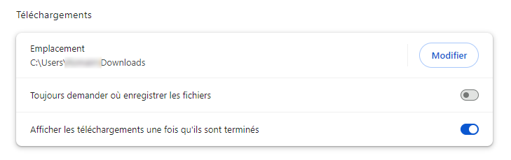

## Firefox

> ### ⚠️ Dans Firefox, le module devra être réinstallé à chaque démarrage
>
> préférez [l'utilisation de Chrome](#install-chrome) si possible (ouep, déso 😞)

**1°** Ouvrez le navigateur firefox (https://www.mozilla.org/fr/firefox/new/)

**2°** Rendez-vous dans le menu en haut à droite du navigateur

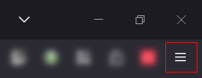

**3°** Rendez-vous dans le menu de gestion des extensions de Firefox

> Menu `Extensions et thèmes`

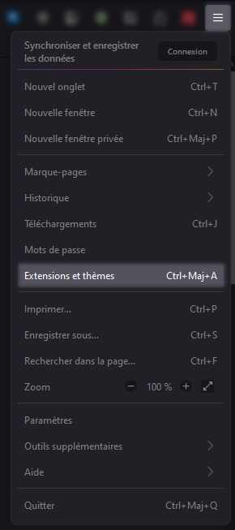

**4°** Cliquez sur le menu `Déboguer les modules`

> Un nouvel onglet va s'ouvrir.

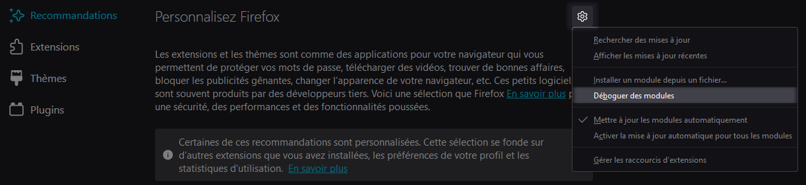

**5°** Cliquez sur le bouton `Charger un module complémentaire temporairement`

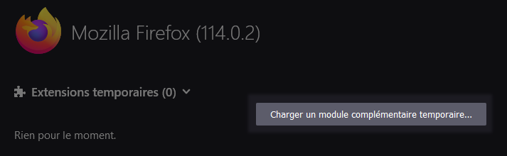

**6°** Sélectionnez le fichier `manifest.json` dans le répertoire extrait à l'étape n°2

> Par exemple : `C:\Program Files\smart-download-helper\manifest.json`

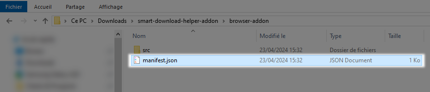

**7°** L'extension devrait être chargée

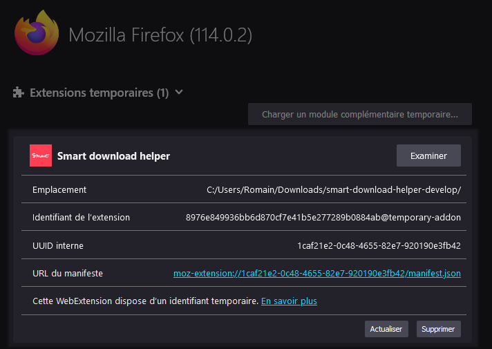

**8°** Autorisez le chargement automatique de l'extension sur la page

> Retournez dans le menu de gestion de vos extensions
> Menu `Extensions et thèmes`

> Rendez-vous dans le menu de gestion de l'extension `Smart download helper`

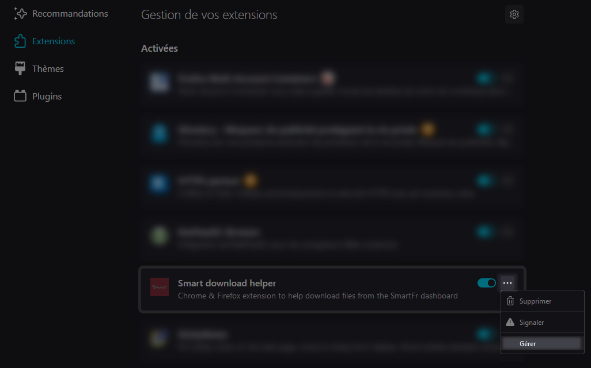

> Onglet `Permissions`
> Cliquez sur `Accéder à vos données pour https://compte.smartfr.fr`

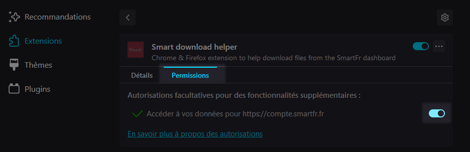

**9°** Activez le téléchargement automatique des fichiers

> Menu `Paramètres` Puis faites défiler la page jusqu'à la section Téléchargements

- Sélectionnez un emplacement pour enregistrer les fichiers
- Décochez la case "Toujours demander où enregistrer les fichiers"

# *III.* UTILISATION DU PLUGIN

**1°** Connectez-vous à votre compte SmartFr

> https://compte.smartfr.fr

**2°** Rendez-vous sur la liste des contrats acceptés

> Menu `Historique > Contrats acceptés`

**3°** Si l'extension est bien chargée et activée, une pop-up de gestion des téléchargements apparaît sur la droite de
la page et des cases à chocher sont ajoutées à coté des documents à télécharger.

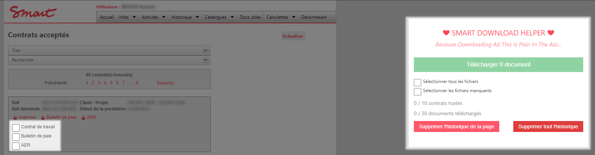

**4°** Vous pouvez maintenant sélectionnez les fichiers que vous souhaitez télécharger.

Pour cela vous pouvez

- Utiliser les deux options de la pop-up de gestion des téléchargements

  - `Sélectionner tous les fichiers` Pour tout sélectionner
  - `Sélectionner les fichiers manquants` Pour ne sélectionner que les fichiers qui n'ont pas encore été téléchargés
- Ou ne sélectionner que certains fichiers en cochant la case à gauche de chacun d'entre eux.

*5°* Cliquez sur le bouton "Télécharger X documents"

> Les téléchargements se lancent et vous devez patienter jusqu'à la fin

*6°* Répétez cette opération sur chacune des pages listant vos documents

> Oui c'est long, mais avez vous essayé de le faire à la main pour chaque fichier ? :p

## Erreurs de téléchargement

Il arrive que des erreurs se produisent lors des téléchargements.
Cela est souvent dû à un fichier manquant.
L'interface Smart est faite de telle manière que tous les téléchargements en cours sont stoppés.
Dans ce cas, le plugin est limité et vous devez relancer les téléchargements.

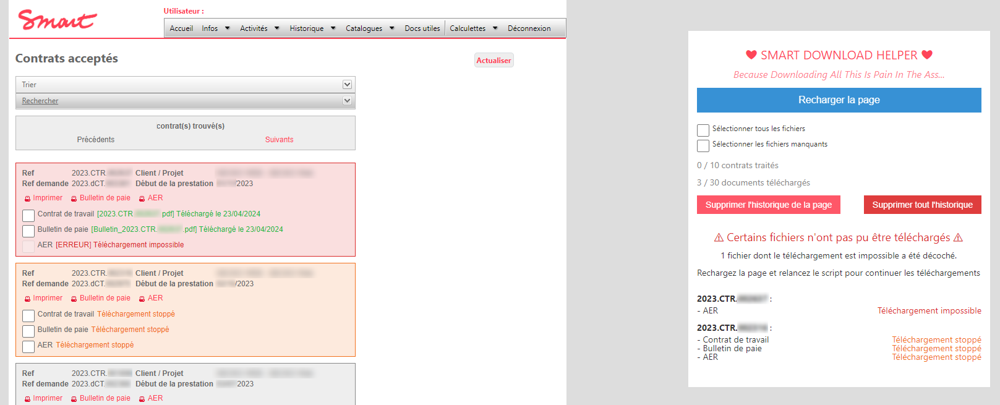

*1°* Cliquez sur le bouton `Recharger la page`

*2°* Sélectionnez les fichiers à télécharger en cochant un à un les fichiers ou en cochant
l'option `Sélectionner les fichiers manquants` de la pop-up de gestion des téléchargements

*3°* Relancez les téléchargements en cliquant sur le bouton "Télécharger X documents"

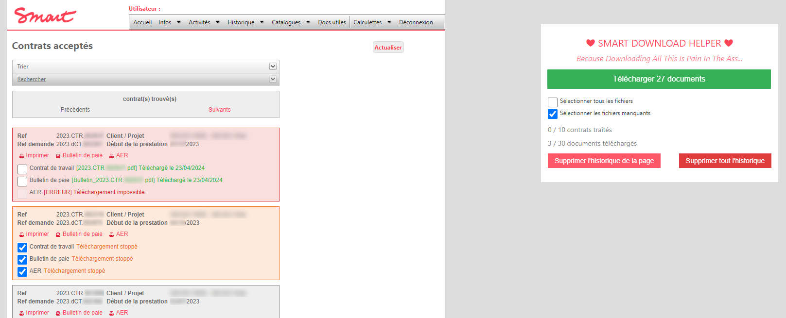

### Les fichiers marqués en rouge `[ERREUR]`

Ces fichiers ne peuvent être téléchargés car ils sont manquants.

**Vous devriez rapidement vous rapprocher de Smart afin qu'ils vous les transmettent dans les plus brefs délais**

Dans la plupart des cas il s'agit des Attestations Employeur Rematérialisées (AER).

> L'AER est un document au format PDF remis par Pôle emploi à l'employeur à la suite d'une Attestation Employeur
> Dématérialisée (AED). Elle permet au salarié de faire valoir ses droits à l'assurance chômage.

Si ces AER ne sont pas disponibles dans l'interface, il est fort probable qu'ils n'aient pas été transmis à "Pôle
Emploi", ce qui pourrait entraîner un recalcul de vos droits au chômage.

### ⚠️ Encore une fois, je vous invite vivement à faire la demande des documents manquants auprès de Smart. ⚠️

# *IV.* Ça vous a été utile ? Faites-le-moi savoir ! 😊

Si cette extension vous a été utile et que vous en avez l'envie et les moyens, pourquoi ne pas me payer une bière ?
*(je prend également les grosses bagnoles 🚗, yachts 🛥️, châteaux 🏰, îles privées 🏝️, fusées spatiales 🚀 ou licornes en
or massif 🦄)*

[🍺 Payer une bière !](https://paypal.me/GeckoWeb35?country.x=FR&locale.x=fr_FR)

